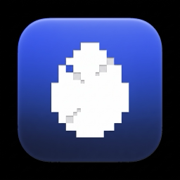

<div align="center">



<h1>EvoPet</h1>

<p>
  One pixel-art companion that lives on your desktop and in your agent's terminal,
  and grows from the work you actually do.
  <br />
  One pet, not one per tool: every profile, every group chat and every agent you run
  feeds the same creature.
</p>

<p>
  <a href="https://github.com/ahrazzle/EvoPet"><strong>EvoPet</strong></a>
  &nbsp;·&nbsp;
  <a href="https://github.com/ahrazzle/TamaHermes">TamaHermes</a>
  &nbsp;·&nbsp;
  <a href="https://github.com/Alichua/TamaCodex">TamaCodex</a>
  &nbsp;·&nbsp;
  <a href="https://github.com/crafter-station/petdex">PetDex</a>
</p>

</div>

---

## What EvoPet is

EvoPet is a cross-agent desktop companion with two halves, built and maintained
separately, that only make sense together:

- **The pet** owns the mechanics: XP, the level ladder, the stats, the life stages and
  evolution. It draws the sprite atlas that every surface renders, so the terminal pet, the
  desktop pet and the preview can never drift apart. Python; it installs from its own tree.
- **The desktop shell** floats that creature above your other windows with a HUD, and taps
  the hook payload every hooked agent sends, so the ledger counts Claude Code, Codex,
  opencode and Gemini CLI alongside Hermes. A native build on a pinned SDK, and it lives in
  this repository.

The pet is the reason the project exists; the shell is the surface it appears on.

## Where EvoPet comes from

EvoPet brings a pet lineage and a desktop-shell lineage together. Being exact about the
debt is part of the project:

- **The pet half comes from TamaHermes, which continues TamaCodex.**
  [TamaCodex](https://github.com/Alichua/TamaCodex) is the original upstream/source project
  for the pet-creation lineage. [TamaHermes](https://github.com/ahrazzle/TamaHermes) is that
  lineage's maintained pet-half predecessor, and it is the tree EvoPet's pet half is built
  from. TamaHermes carries on in parallel; EvoPet does not replace it.
- **The shell half is PetDex-inspired.**
  [PetDex](https://github.com/crafter-station/petdex) is credited as the inspiration and
  homage behind EvoPet's desktop shell/app lineage: the floating companion, the hook
  pipeline, the sprite format, the gallery idea. An earlier mirror of that lineage was
  published as `ahrazzle/petdex`.

  **EvoPet is not a fork of PetDex, and it should not be described as one.** PetDex is a
  gallery and a desktop floater with no progression model anywhere in it; EvoPet's whole
  point is a progression model — shared XP, levels, stages and evolution — that PetDex has
  no concept of. The shell borrows a lineage and credits it; the pet is new work on the
  TamaCodex/TamaHermes line.

## One pet, shared XP

The defining requirement, and the reason the combined ledger exists: **one pet per person,
not one per tool.**

- Every Hermes profile you run feeds the same creature.
- Group chats feed the same creature.
- Every other hooked agent (Claude Code, Codex, opencode, Gemini CLI) feeds the same
  creature too.

Two routes lead into one combined ledger, each source counted on exactly one of them so
nothing is double-counted. Growth is read at turn boundaries only, so a turn in one agent
is worth a turn in another. The combined ledger is seeded by force-combining the existing
per-profile XP, so switching to it loses no progress.

Only numbers are stored: XP, counters, stats and traits. Never your prompts, never tool
output, never a file path. That restriction is enforced by the combined ledger's own test,
not by convention.

## Status

Honest, as of 11 September 2026:

- The pet's mechanics, the combined ledger and the drain that fills it are in the pet tree.
- The desktop shell runs as a **local build** on macOS. There is no notarized download yet,
  and a bundle built on one Mac is rejected by Gatekeeper on any other, so nothing installs
  on a machine that did not build it.
- The library service is written and passes its own end-to-end round trip, but it is **not
  deployed**. The site's library page reports that it cannot reach the library rather than
  showing a fake empty shelf.
- EvoPet's own repository is public as of 11 September 2026.

## Install and develop

The pet and the shell install separately, and the pet runs alone in the terminal with no
desktop app at all.

**The pet half.** From a checkout of the pet tree:

```sh
./hermes/install-hermes.sh --line toast --machine aurora
hermes plugins enable tamahermes
hermes pets select tamahermes
hermes pets doctor        # should report the pet ready
```

Hermes homes are profile-scoped, so install once per profile you actually use.
`install-all-profiles.sh` covers the default profile and every named profile on the machine
in one command. To float the pet on the desktop, mirror it into the shell's pet directory.

**The desktop shell.** Today the honest path is to build it from the app tree on the machine
that will run it; it is a native build against a pinned SDK, and macOS distribution needs
local notarization.

**The project site.** `site/` is a static Astro site with no runtime dependency beyond the
browser reading the library's public index:

```sh
cd site
npm ci
npm run build      # -> site/dist
```

Node 22.12 or newer (Astro 7 requires it). Repository work uses Bun at the root —
`bun install`, then `bun run dev:docker` for a local full stack. See
[`CONTRIBUTING.md`](./CONTRIBUTING.md) and [`AGENTS.md`](./AGENTS.md).

## Repository layout

```text
EvoPet/
├── packages/
│   ├── petdex-desktop-native/   the desktop shell: native app, hook server, sprite renderer
│   ├── petdex-cli/              the catalog client CLI
│   └── discord-bot/             the community bot
├── site/                        the EvoPet project site (Astro, GitHub Pages)
├── src/                         the web app (Next.js) and its API routes
├── drizzle/                     Postgres schema migrations
├── docs/                        project notes
└── scripts/                     build, release and maintenance scripts
```

The pet tree is a separate checkout, not a directory in this repository.

## Licenses

The source code is [MIT](./LICENSE). Pet assets — sprites and other artwork — are owned by
their submitters under whatever license they declare.
